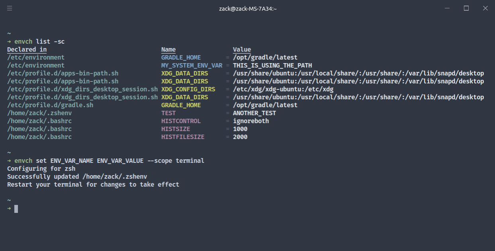

# envch



An intuitive program that allows users to create, modify, list, and remove environment variables

## Installation

## Snap
Envch only supports Linux. To install using Snap, run:
```bash
sudo snap install envch
```

# Manually
To manually install envch, run the following:
```bash
git clone https://github.com/ZackMurry/envch.git
cd envch

cargo build --release

cd target/release
./envch
```
